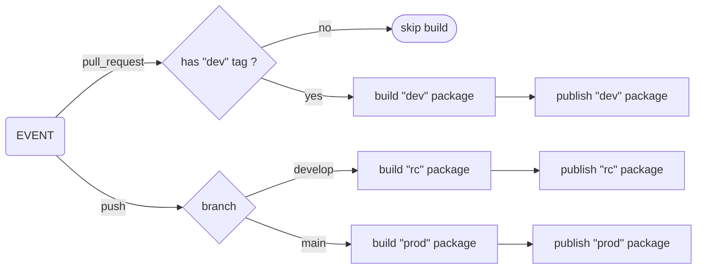

# Contributing

This projet is open to everyone. Feel free to test the library, share it, improve it, and create merge requests.

## Getting started

### Tools

#### [nvm](https://github.com/nvm-sh/nvm)

We recommend using [nvm](https://github.com/nvm-sh/nvm) to manage your Node.js versions.

```shell
curl -o- https://raw.githubusercontent.com/nvm-sh/nvm/v0.40.3/install.sh | bash
```

#### [Node](https://nodejs.org)

```shell
nvm use

# Verify the Node.js version:
node -v
```

#### [Yarn](https://yarnpkg.com)

```shell
corepack enable yarn

# Verify Yarn version:
yarn -v

# Install the dependencies:
yarn install
```

### Code

- The source code is located in the `src` directory.
- The projet uses [prettier](https://prettier.io/) to format the code. You'll want to enable and configure it in your IDE.
- The tests run with [vitest](https://vitest.dev)

### Commands

- `fb:build`: builds the library.
  - converts the typescript files into javascript files, copies the scss files, and assembles all the assets to create a package ready to be published.
  - some files are handled differently:
    - `*.protected.{ts,scss}` or `**/*.protected/**`: these files are exported under `package-name/protected`
      - this is indented to expose parts of the code that should be restricted to advanced users only, or shared to other libraries requiring _internal_ control.
    - `*.private.{ts,scss}` or `/*.private/**`: these files are **not** exported.
      - this is indented to consume parts of the code internally, and not expose them publicly.
- `fb:format`: formats the code using `prettier`.
- `fb:test`: runs the tests using `vitest`.
- `fb:test:coverage`: runs the tests with coverage.
  - by default, 100% code coverage is required, to enforce good quality.
- `fb:bench`: runs the bench tests.
- `fb:typedoc`: generates the documentation.
  - if the library exposes publicly only a few and/or simple parts, the documentation may be defined in the `README.md` instead.

### To create a PR

1. fork the repository
1. add the feature/fix by modifying the code in the `src/` directory
1. add/write some tests until 100% code coverage is reached (run the tests with `yarn fb:test:coverage`)
1. format the code, using the command `yarn fb:format`
1. commit and push your work following the [Conventional Commits](https://www.conventionalcommits.org/en/v1.0.0/) convention
1. create a PR from your repository to the upstream repository, explaining clearly what was added/fixed.

## Release Workflow

### 1. Pull Request to `main` or `develop`

- The `release.yml` workflow runs on `pull_request`
- The `yarn fb:ci:release` step runs **only if** the PR has the `dev` label
- Impacted packages are published as:
- `x.y.z-dev.<timestamp>`
- npm dist-tag: `dev`

### 2. Push to `develop`

- Impacted packages are published as:
- `x.y.z-rc.<timestamp>`
- npm dist-tag: `rc`

### 3. Push to `main`

- Stable publication:
- `x.y.z`
- npm dist-tag: `latest`
- Only if `name@x.y.z` does not already exist on npm

### Graph



## Important Rules

- if the version already exists on npm: the release is skipped
- the `package.json` file in the repo must keep stable versions (`x.y.z`)
- `-dev` / `-rc` suffixes are generated in CI
